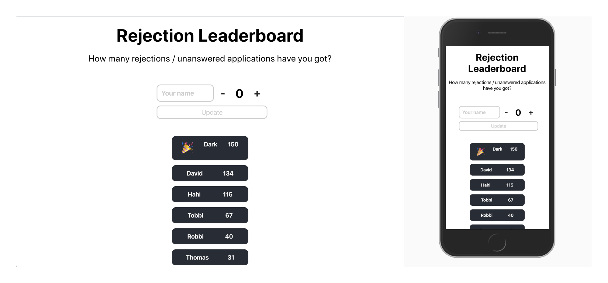
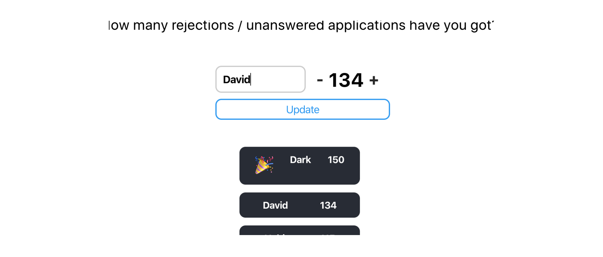

A fun little project to see who has the most unanswered applications and job offer rejections. This helps to show that everybody gets rejections and your value as a person is not defined by the success in your career. Lets celebrate the person with the most rejections and encourage them to keep going!

---

### Backend

Using Airtable, user information is kept track of. Setting up Google Firebase Cloud Functions, the airtable functionality is hosted.

---

## Frontend

Built in React.js, styled with CSS.

---
